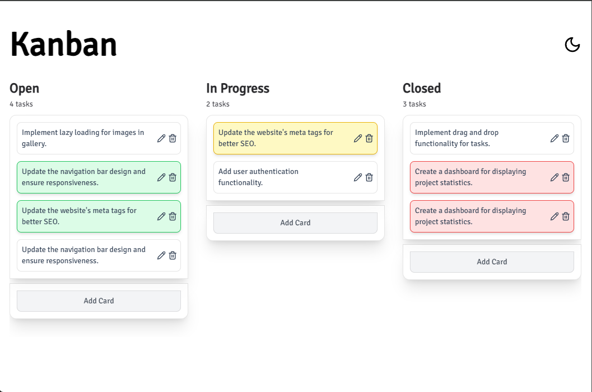
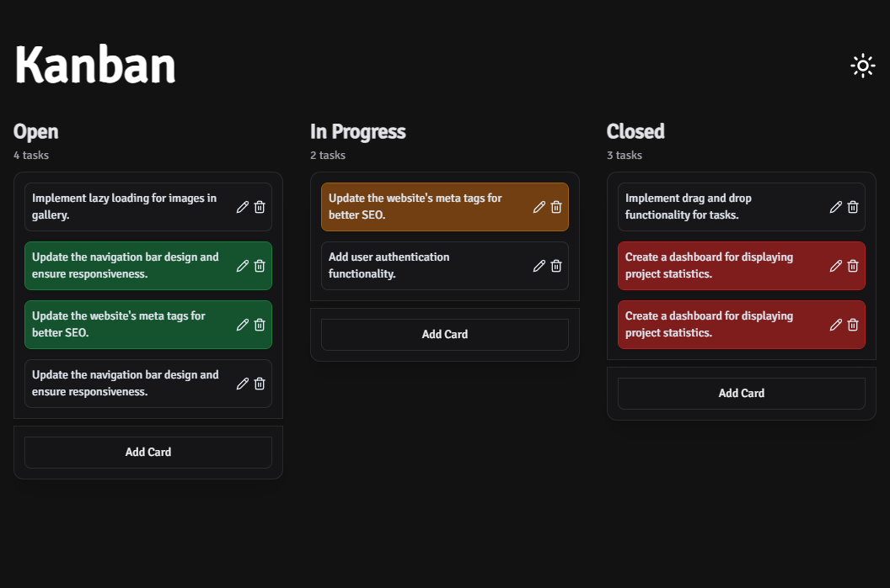
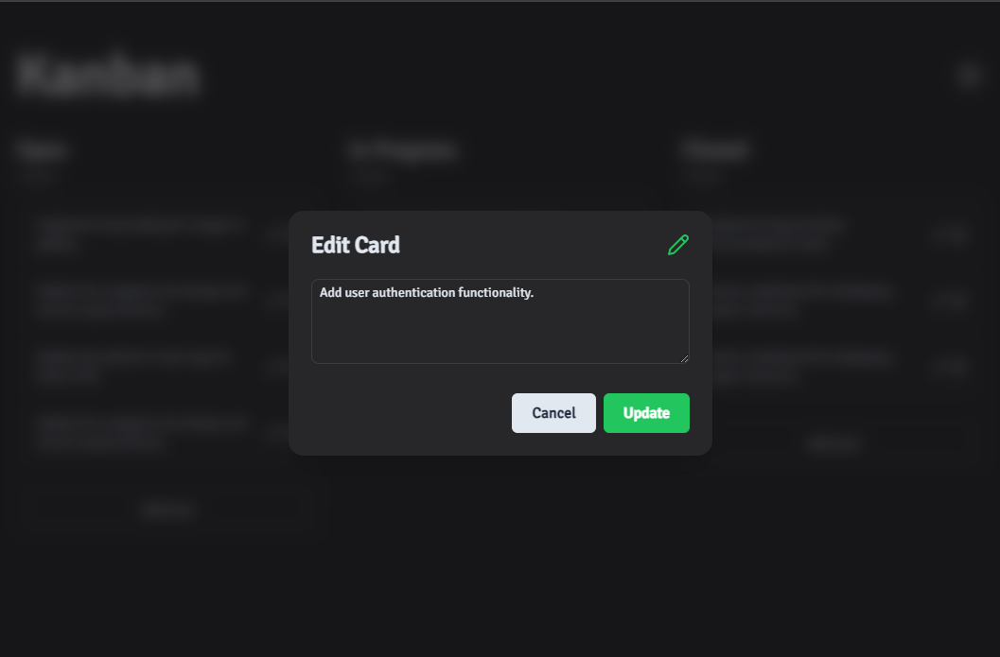
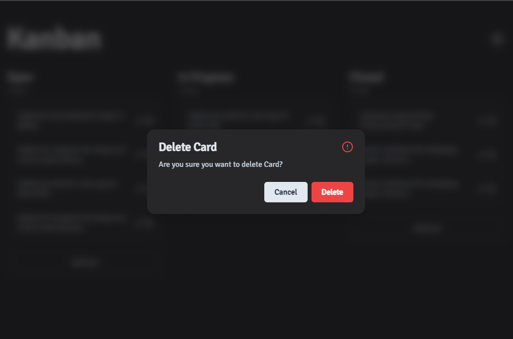

# Project Title: Fully Accessible Kanban Todo

## Description

This project is a fully accessible Kanban Todo application. The primary technologies used include NextJS, React Aria, React Stately, and Tailwind CSS. The application utilizes React Aria for seamless drag-and-drop actions and React Stately for efficient state management. Keyboard navigation is also supported for users who prefer to navigate the application without a mouse.

## Technologies Used

- [NextJS](https://nextjs.org/): A React framework for building server-side rendered and statically generated web applications.
- [React Aria](https://react-spectrum.adobe.com/react-aria/index.html): A set of React hooks for building accessible UI components.
- [React Stately](https://react-spectrum.adobe.com/react-stately/index.html): A library for managing application state in React applications.
- [Tailwind CSS](https://tailwindcss.com/): A utility-first CSS framework that simplifies the process of designing responsive and scalable user interfaces.

## Screenshots

